# Redes Neuronales

Workshop de Redes Neuronales usando Watson Studio para la UNAM FES Acatlan (*19 de octubre de 2019*) [Presentación]()

**Diagrama de servicios que maneja Watson Studio**

## Práctica
Construcción una red neuronal para reconocer dígitos escritos a mano utilizando el conjunto de datos MNIST

## Objetivo general
Entrenar un modelo de aprendizaje profundo para reconocer dígitos escritos a mano.

### Objetivos especificos
* Diseñar una [red neuronal convolucional](https://es.wikipedia.org/wiki/Redes_neuronales_convolucionales) (CNN) con una capa convolucional usando el editor de flujo en IBM Watson Studio.
* Entrenar, implementar y probar el modelo usando el generador de experimentos en Watson Studio.

## MNIST

La base de datos MNIST es una gran base de datos de dígitos escritos a mano que se usa comúnmente para capacitar a varios sistemas de procesamiento de imágenes. La base de datos también se usa ampliamente para capacitación y pruebas en el campo del aprendizaje automático.

## Prerequisitos

* [Cuenta IBM Cloud](https://cloud.ibm.com/) para crear una cuenta, se detalla en el manual:
    * [Crear una cuenta](https://github.com/fatalityignpab/Workshop-Redes-Neuronales/blob/master/2.%20Academic%20Initiative%20-%20Creating%20an%20IBM%20Cloud%20Account.pdf) (Pueden usar correos personales)
* [Código IBM Cloud](https://my15.digitalexperience.ibm.com/b73a5759-c6a6-4033-ab6b-d9d4f9a6d65b/dxsites/151914d1-03d2-48fe-97d9-d21166848e65/technology/cloud) para generar código de estudiante, se detalla en el manual:
    * [Cómo generar código](https://github.com/fatalityignpab/Workshop-Redes-Neuronales/blob/master/1.%20Academic%20Initiative%20-%20Requesting%20an%20IBM%20Cloud%20Promo%20Code%20(new%20version).pdf) (Solo para Estudiantes o Facultades)
    * [Aplicar código a mi cuenta](https://github.com/fatalityignpab/Workshop-Redes-Neuronales/blob/master/3.%20Academic%20Initiative%20-%20Applying%20an%20IBM%20Cloud%20Promo%20Code.pdf)
* Datos de entrenamiento (Se encuentra en este respositorio, sirve para que la red neuronal pueda ser entrenada con esos datos)
    * mnist-keras-train.pkl
    * mnist-keras-validate.pkl
    * mnist-keras-test.pkl
* Modelo pre-entrenado
    * mnist-keras-test-payload.json

### Herramientas (Servicios)

* [IBM Watson Studio](https://cloud.ibm.com/catalog/services/watson-studio) - Servicio usado para análisis de datos.
* [IBM Watson Machine Learning Service](https://cloud.ibm.com/catalog/services/machine-learning) - Servicio usado para calcular gráficas
* [Cloud Object Storage](https://cloud.ibm.com/catalog/services/cloud-object-storage) - Servicio usado para subir una base de datos no estructurada (noSQL)

Si ya tienen esas herramientas creadas, lo puedes visualizar en su [Lista de recursos > Servicios (Studio y ML) || > Almacenamiento (Object Storage)](https://cloud.ibm.com/resources)

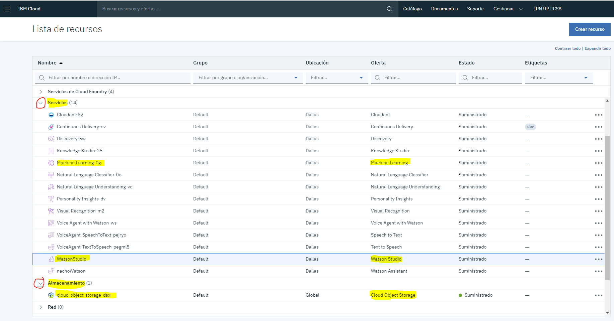

## Comenzamos

Para comenzar a realizar la practica, debemos de tener en nuestra cuenta los 3 servicios IBM, para encontrarlos vamos a [Catálogo](https://cloud.ibm.com/catalog):

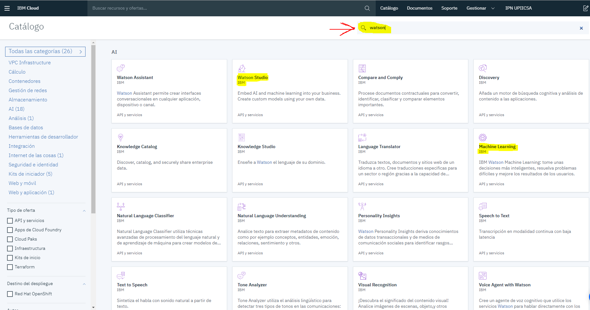

Como recomendación, podremos dejar por default al crear los servicios, damos en el boton Crear

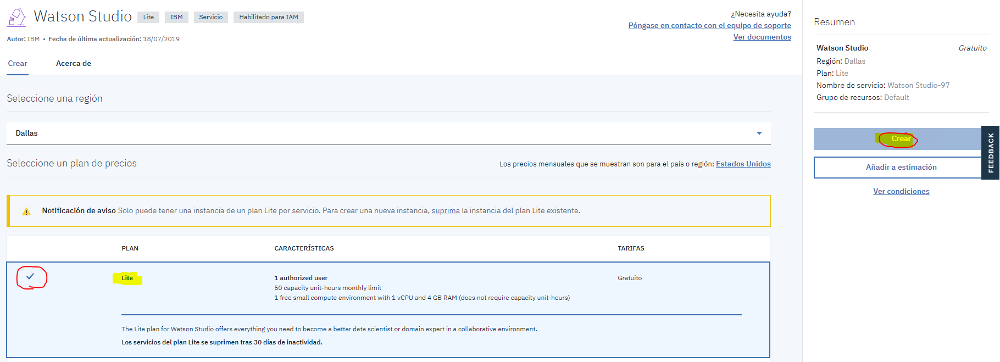

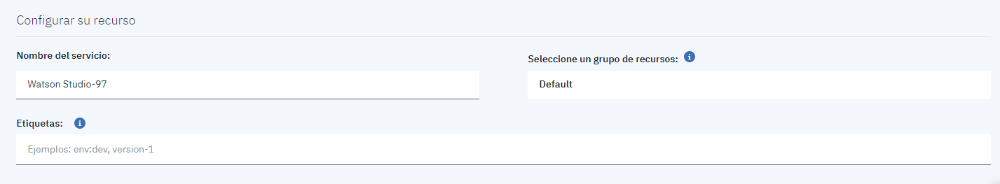

Una vez creado los 3 servicios, podremos dar comienzo a la practica, podremos consultar a nuestra [Lista de recursos](https://cloud.ibm.com/resources).

### Carga de datos

Vamos en el servicio de Cloud Object Storage, donde vamos a crear 2 depositos, uno para almacenar datos de entrenamiento y otro para almacenar resultados de entrenamiento.

Una vez creado el deposito, creamos otro, para ello, navegaremos a "Getting started" y en "Creating buckets" y damos en el botón "Crear depodito":

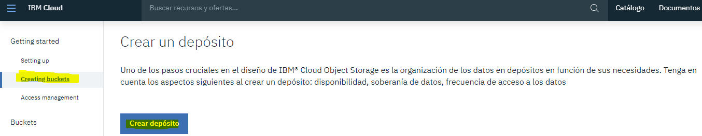

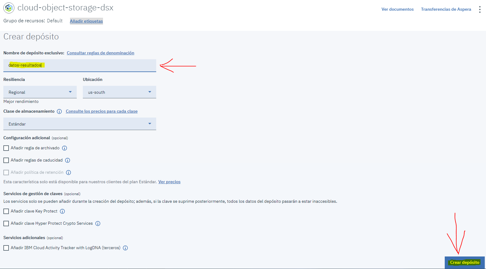

Una vez creados, vamos en la sección de "Bucket" y veremos los 2 depositos creados:

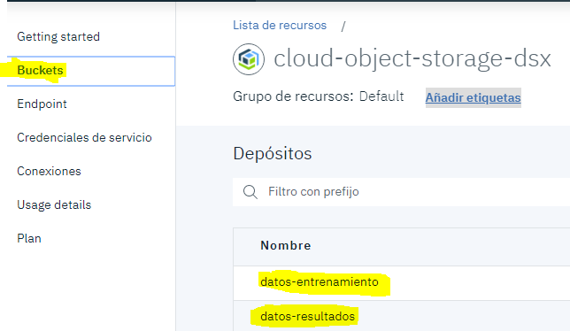

Accederemos a nuestro deposito de entrenamiento, y ahí agregaremos los 3 datos de entrenamiento:

    * mnist-keras-train.pkl
    * mnist-keras-validate.pkl
    * mnist-keras-test.pkl

Puedes agregar ya sea arrastrar los archivos o subirlos manualmente en el boton "Subir":

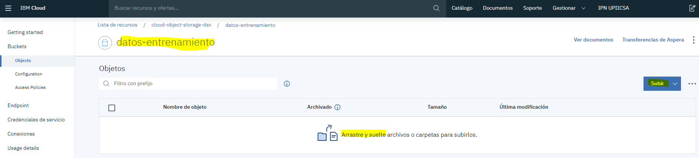

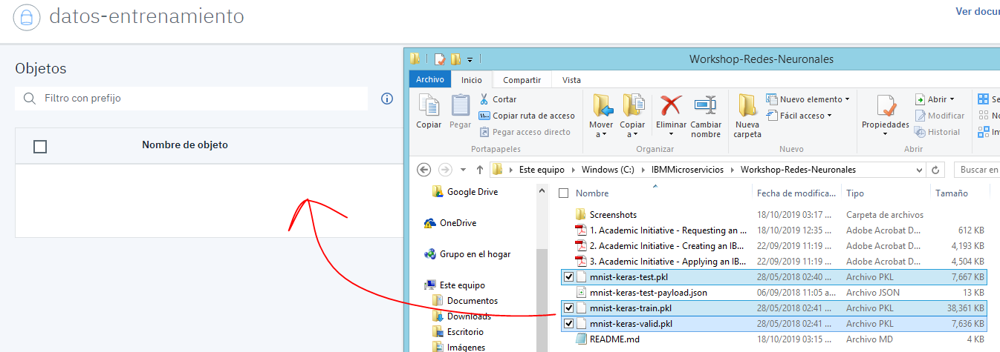

Esperamos a que termine de cargar los dataset (50 MB / 15 minutos aprox.) y ya quedaría este paso.

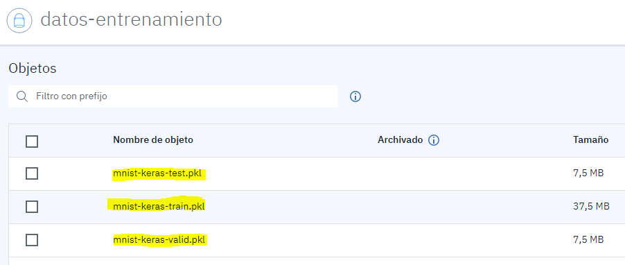

### Creación de una red neuronal

En este tutorial demuestra cómo puede crear un diseño de red neuronal basado en una muestra en la interfaz de usuario del editor de flujo.

Vamos a nuestro servicio Watson Studio y daremos clic en "Get Started"

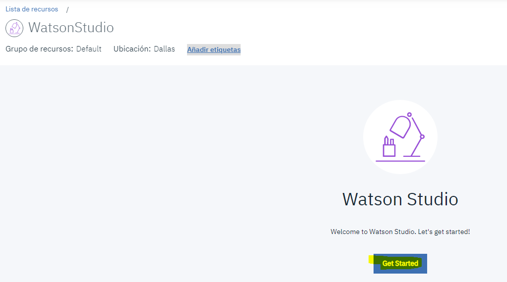

Una vez dentro de Watson Studio, vamos a crear un proyecto, dando clic en "":

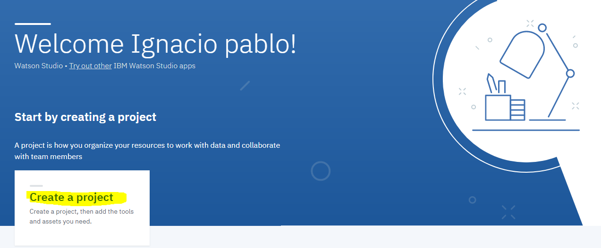

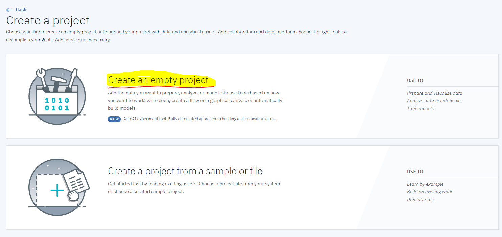

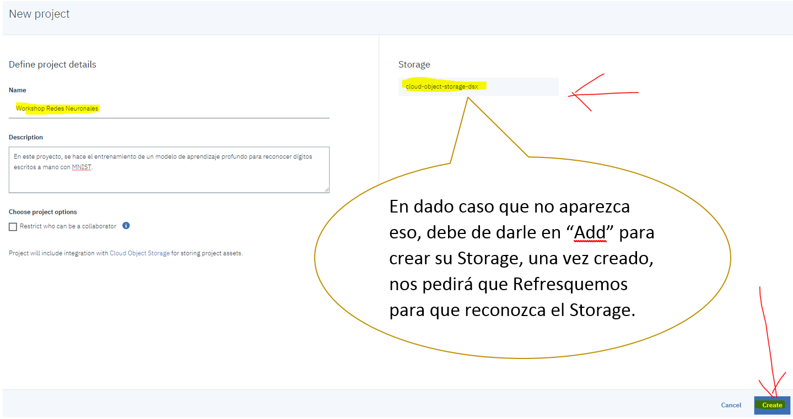

Una vez dentro del proyecto, vamos a dar clic en "Add to project" y seleccionamos "Modeler Flow":

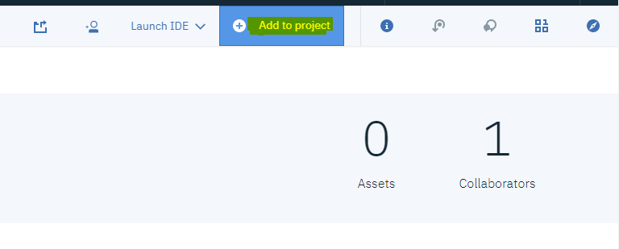

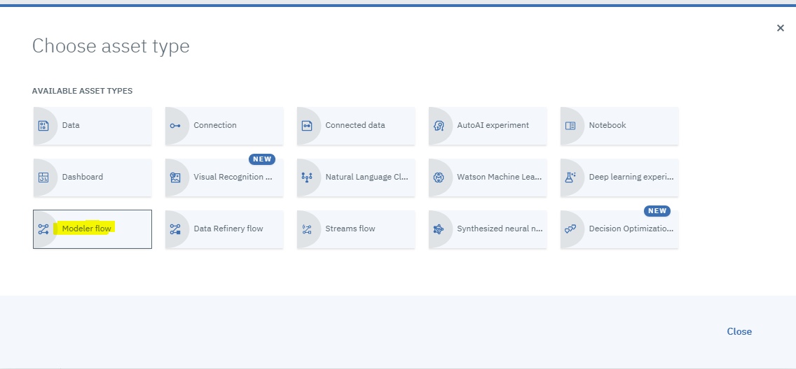

Una vez dentro, vamos a darle "From Example" y seleccionaremos "Single Convolution layer on MNIST" y damos clic en el botón "Create" (Si no les aparece el modelo, intentelo en Modo Incognito):

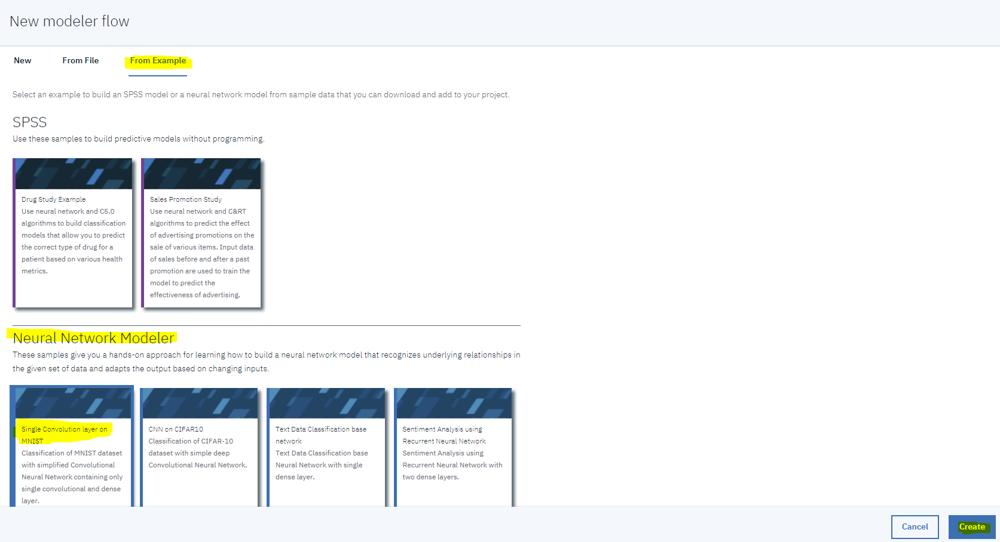

Dentro del modelo, veremos ya prehecho una red neuronal (ver más en [Nodos para Red Neuronal en watson](https://dataplatform.cloud.ibm.com/docs/content/wsj/analyze-data/ml-canvas-nnd-nodes.html))

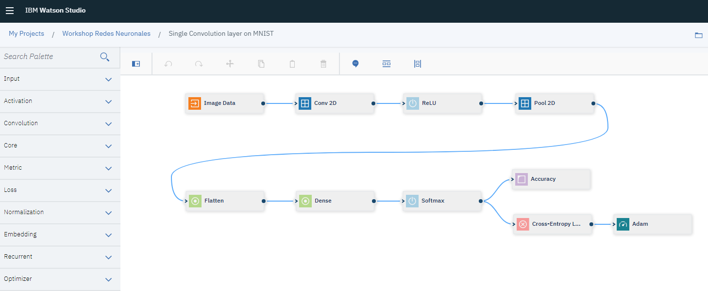

## Autores

* **Ignacio Pablo Orozco Dávila** - *IBM Advocate* - [LinkedIN](https://www.linkedin.com/in/ignacio-pablo-orozco-d%C3%A1vila-00997315b/)
* **Rafael González Martínez** - *IBM Advocate*
* **Karla Cabañas García** - *IBM Advocate*

### Créditos

[IBM Developer](https://www.ibm.com/developerworks/ssa/index.html)