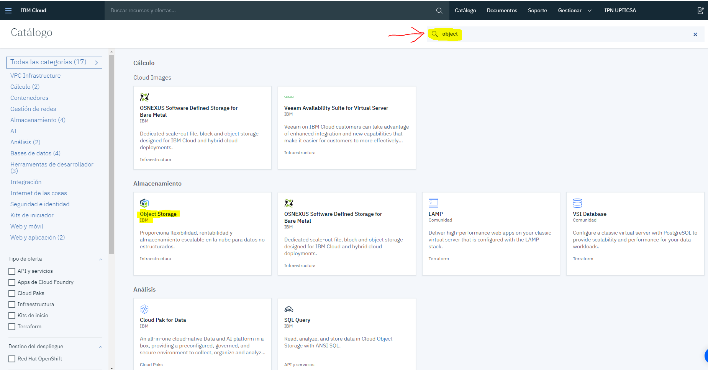

# Redes Neuronales

Workshop de Redes Neuronales usando Watson Studio para la UNAM FES Acatlan (*19 de octubre de 2019*) [Presentación]()

**Diagrama de servicios que maneja Watson Studio**

## Prerequisitos

* [Cuenta IBM Cloud](https://cloud.ibm.com/) para crear una cuenta, se detalla en el manual:
    * [Crear una cuenta](https://github.com/fatalityignpab/Workshop-Redes-Neuronales/blob/master/2.%20Academic%20Initiative%20-%20Creating%20an%20IBM%20Cloud%20Account.pdf) (Pueden usar correos personales)
* [Código IBM Cloud](https://my15.digitalexperience.ibm.com/b73a5759-c6a6-4033-ab6b-d9d4f9a6d65b/dxsites/151914d1-03d2-48fe-97d9-d21166848e65/technology/cloud) para generar código de estudiante, se detalla en el manual:
    * [Cómo generar código](https://github.com/fatalityignpab/Workshop-Redes-Neuronales/blob/master/1.%20Academic%20Initiative%20-%20Requesting%20an%20IBM%20Cloud%20Promo%20Code%20(new%20version).pdf) (Solo para Estudiantes o Facultades)
    * [Aplicar código a mi cuenta](https://github.com/fatalityignpab/Workshop-Redes-Neuronales/blob/master/3.%20Academic%20Initiative%20-%20Applying%20an%20IBM%20Cloud%20Promo%20Code.pdf)
* Dataset (Se encuentra en este respositorio)
    * mnist-keras-train.pkl
    * mnist-keras-validate.pkl
    * mnist-keras-test.pkl
* Modelo pre-entrenado
    * mnist-keras-test-payload.json

### Herramientas (Servicios)

* [IBM Watson Studio](https://cloud.ibm.com/catalog/services/watson-studio) - Servicio usado para análisis de datos.
* [IBM Watson Machine Learning Service](https://cloud.ibm.com/catalog/services/machine-learning) - Servicio usado para calcular gráficas
* [Cloud Object Storage](https://cloud.ibm.com/catalog/services/cloud-object-storage) - Servicio usado para subir una base de datos no estructurada (noSQL)

Si ya tienen esas herramientas creadas, lo puedes visualizar en su [Lista de recursos > Servicios (Studio y ML) || > Almacenamiento (Object Storage)](https://cloud.ibm.com/resources)

## Comenzamos

Para comenzar a realizar la practica, debemos de tener en nuestra cuenta los 3 servicios IBM, para encontrarlos vamos a [Catálogo](https://cloud.ibm.com/catalog):

Como recomendación, podremos dejar por default al crear los servicios, damos en el boton Crear

Una vez creado los 3 servicios, podremos dar comienzo a la practica, podremos consltar a nuestra [Lista de recursos](https://cloud.ibm.com/resources).

### Carga de datos

Vamos en el servicio de Cloud Object Storage, donde vamos a crear 2 depositos, uno para almacenar datos de entrenamiento y otro para almacenar resultados de entrenamiento.

## Autores

* **Ignacio Pablo Orozco Dávila** - *IBM Advocate* - [LinkedIN](https://www.linkedin.com/in/ignacio-pablo-orozco-d%C3%A1vila-00997315b/)
* **Rafael González Martínez** - *IBM Advocate*
* **Karla Cabañas García** - *IBM Advocate*

### Créditos

[IBM Developer](https://www.ibm.com/developerworks/ssa/index.html)